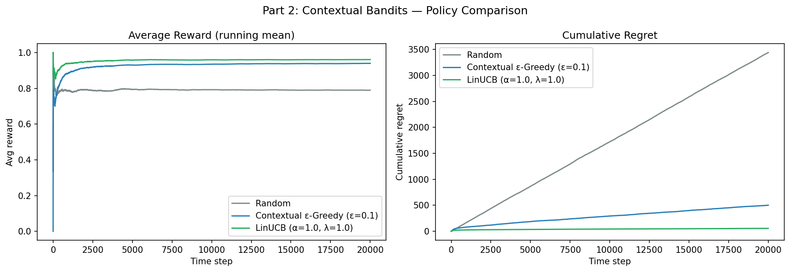

# Contextual Bandit News Recommendation

Implements and compares bandit algorithms for personalized news recommendation.
A user arrives with a context vector (preferences + age), and the agent must
learn which article to recommend to maximize click-through rate over time.

---

## Problem Setup

Each time step a user arrives with a 6-dimensional context:

| Feature | Description |
|---|---|
| `likes_politics` | Interest in political content |
| `sports_fan` | Interest in sports |
| `techie` | Interest in technology |
| `mobile_user` | Tends to read on mobile |
| `morning_reader` | Reads in the morning |
| `age_z` | Standardized age: (age − 40) / 15 |

There are 4 articles (arms): **Politics, Sports, Tech, Lifestyle**.

Click probability follows a logistic model:
```
P(click | arm a, context x) = sigmoid(θ_a · x)
```

The agent observes the reward (click=1 / no click=0) and updates its policy.

---

## Algorithms

### Part 1 — Non-Contextual Bandits
Classic multi-armed bandit setting: no context, fixed unknown click probabilities.

| Algorithm | Idea |
|---|---|
| **ε-Greedy** | Exploit best-known arm with prob 1−ε; explore randomly with prob ε |
| **UCB1** | Pick arm maximizing Q[a] + c·√(ln t / N[a]); optimism under uncertainty |

### Part 2 — Contextual Bandits
User context is available at each step. Algorithms learn a personalized mapping.

| Algorithm | Idea |
|---|---|
| **Random** | Uniform random baseline, ignores context |
| **Contextual ε-Greedy** | Linear model per arm; ε-greedy on predicted reward |
| **LinUCB** | Ridge regression per arm + UCB exploration bonus on feature uncertainty |

---

## Results

### Part 1: Non-Contextual (T = 10,000, probs = [0.2, 0.1, 0.5, 0.9])

| Algorithm | Total Reward | Avg Reward | Cumulative Regret |
|---|---|---|---|
| ε-Greedy (ε=0.1) | 8,494 | 0.849 | 487.7 |
| **UCB (c=1.0)** | **8,959** | **0.896** | **40.7** |

UCB accumulates **12× less regret** than ε-greedy by efficiently targeting
high-uncertainty arms early, then concentrating on the best arm.

### Part 2: Contextual (T = 20,000)

| Algorithm | Total Reward | Avg Reward | Cumulative Regret |
|---|---|---|---|
| Random | 15,792 | 0.790 | 3,440.2 |
| Contextual ε-Greedy (ε=0.1) | 18,793 | 0.940 | 501.6 |
| **LinUCB (α=1.0)** | **19,216** | **0.961** | **56.1** |

LinUCB achieves **61× less regret than random** and **9× less than ε-greedy**
by maintaining principled uncertainty estimates over the feature space.



---

## Project Structure

```
contextual-bandit-news-recommendation/
├── environment.py    # BernoulliBandit and ContextualNewsEnv
├── policies.py       # ε-Greedy, UCB, ContextualEpsGreedy, LinUCB
├── simulate.py       # simulation runners and comparison helper
├── visualize.py      # plotting functions
├── main.py           # entry point — runs all experiments
├── requirements.txt
└── notebooks/
    └── contextual-bandit-news-recommendation.ipynb    # original step-by-step notebook
```

---

## Getting Started

```bash
git clone https://github.com/PrashantSU/contextual-bandit-news-recommendation
cd contextual-bandit-news-recommendation
pip install -r requirements.txt
python main.py
```

Results and plots are saved to `results/`.

---

## Key Takeaways

- **Exploration strategy matters significantly**: UCB reduces regret by 12× over
  ε-greedy in the non-contextual setting by adapting exploration to uncertainty.
- **Context dramatically improves performance**: contextual policies achieve
  avg reward of 0.96 vs 0.79 for a context-blind random policy.
- **LinUCB's principled uncertainty quantification** via the inverse gram matrix
  allows it to identify the best arm per user segment much faster than
  heuristic exploration.

---

## References

- Li, L., Chu, W., Langford, J., & Schapire, R. E. (2010).
  *A contextual-bandit approach to personalized news article recommendation.*
  WWW 2010. [arXiv:1003.0146](https://arxiv.org/abs/1003.0146)
- Auer, P., Cesa-Bianchi, N., & Fischer, P. (2002).
  *Finite-time analysis of the multiarmed bandit problem.*
  Machine Learning, 47(2–3), 235–256.
